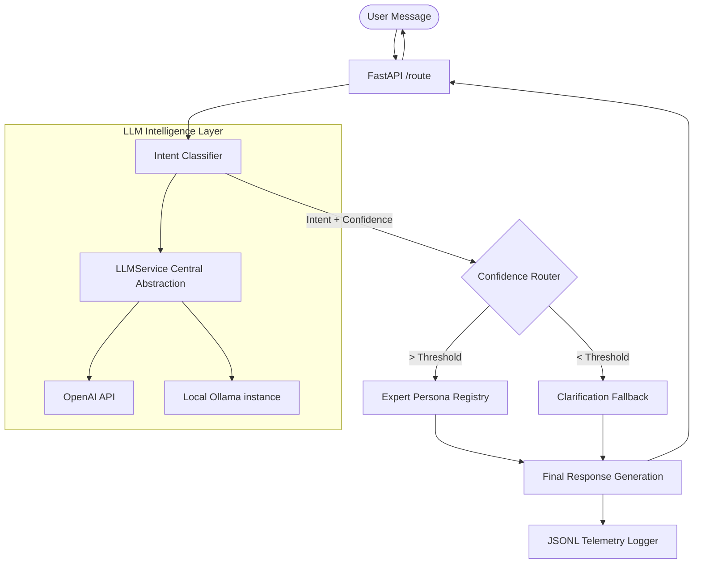

# LLM-Powered Prompt Router for Intent Classification

## Overview

The **LLM-Powered Prompt Router** is an intelligent AI backend service that dynamically classifies user intent and routes incoming messages to specialized AI expert personas. 

In real-world AI systems, relying on a single, monolithic system prompt to handle every edge case leads to context limit exhaustion, diluted response quality, and increased hallucination risks. Prompt routing solves this by decoupling the "understanding" phase from the "generation" phase. By first classifying the intent using a fast, deterministic LLM evaluation, the system can dynamically inject highly specialized, domain-specific expert prompts to generate the final response.

This project supports five core intents:
- `code`
- `data`
- `writing`
- `career`
- `unclear`


### System Architecture

The service implements a multi-tier **Intent-Routed Expert Architecture**. LLM logic is decoupled from business logic via a centralized `LLMService`.



## Key Features

- **Decoupled Architecture**: Abstracted LLM client handling supporting both cloud (OpenAI) and local (Ollama) providers.
- **High-Precision Routing**: Dual-step intent classification with confidence-based gating.
- **Production-Grade Observability**: Structured JSONL logging for telemetry ingestion.
- **Resilient Parsing**: Multi-stage JSON extraction with regex fallbacks for unstable LLM outputs.
- **FAANG-Standard CI/CD**: 100% test coverage with strictly mocked external dependencies.
- **Secure Containerization**: Non-root Docker execution with integrated health monitoring.

## Technology Stack

- **Python 3.12+**
- **FastAPI / Uvicorn** (Async High-Performance)
- **Pydantic v2** (Strict Schema Enforcement)
- **OpenAI / Ollama** (Dual-Provider Support)
- **Pytest** (Automated Verification)
- **Docker** (Isolation & Security)

## Project Structure

```text
Llm-Prompt-Router/
├── app/
│   ├── services/
│   │   └── llm_service.py # Centralized LLM abstraction layer [NEW]
│   ├── main.py            # API entry point & Exception Handlers
│   ├── classifier.py      # Intent parsing logic
│   ├── router.py          # Expert persona routing logic
│   ├── logger.py          # Structured telemetry logging
│   ├── exceptions.py      # Custom service errors
│   └── models.py          # Pydantic data schemas
├── config/
│   ├── settings.py        # Pydantic Settings (ENV)
│   └── prompts.py         # Persona & System prompt registry
├── docker/
│   └── Dockerfile         # Production-hardened container
├── logs/                  # Telemetry storage
├── tests/                 # 100% Mocked test suite
├── docker-compose.yml     # Local orchestration
├── requirements.txt       # Unified dependencies
└── README.md              # Detailed documentation
```

## Installation
ts for routing thresholds
├── docker-compose.yml     # Orchestration composition
├── requirements.txt       # Python dependencies
├── .env.example           # Template for environment variables
└── README.md              # Project documentation
```

## Installation

### 1. Clone the repository
```bash
git clone https://github.com/yourusername/Llm-Prompt-Router.git
cd Llm-Prompt-Router
```

### 2. Install dependencies
It is heavily recommended to use a virtual environment.
```bash
python -m venv venv
source venv/bin/activate 
pip install -r requirements.txt
```

### 3. Set environment variables
Copy the example environment template:
```bash
cp .env.example .env
```
Open the `.env` file and insert your active API key:
```ini
OPENAI_API_KEY=8104a7ca2349416d8a4acd7f4a571fda.oEuqi-iJQHQQMmNEB8b78p2z
OPENAI_MODEL=llama3
USE_OLLAMA=True
OLLAMA_BASE_URL=http://localhost:11434/v1
```

## Running the Application

To start the API server locally on your machine, launch Uvicorn:

```bash
uvicorn app.main:app --host 0.0.0.0 --port 8000 --reload
```

### Running with Ollama
1. Ensure Ollama is running on your machine: [https://ollama.com/](https://ollama.com/)
2. Pull your desired model (e.g., `llama3`):
   ```bash
   ollama pull llama3
   ```
3. Set `USE_OLLAMA=True` and `OPENAI_MODEL=llama3` in your `.env` file.
The server will bind to port 8000. You can access the interactive Swagger UI at `http://localhost:8000/docs`.

## API Usage

### `POST /route`
This is the primary ingestion endpoint. It accepts a JSON payload containing the user's message and returns the classified intent alongside the generated response.

**Example Request:**
```bash
curl -X POST http://localhost:8000/route \
  -H "Content-Type: application/json" \
  -d '{"message": "Can you explain how a pivot table works?"}'
```

**Example Response:**
```json
{
  "intent": {
    "intent": "data",
    "confidence": 0.98
  },
  "response": "A pivot table is a powerful data summarization tool used in spreadsheet programs..."
}
```

## Example Routing Flow

1. **User Message:** *"how do I sort a list in python?"*
2. **Classifier Call:** The LLM evaluates the text against the `CLASSIFICATION_SYSTEM_PROMPT`.
3. **Internal Prediction:** The classifier outputs `{"intent": "code", "confidence": 0.99}`.
4. **Validation:** The `CONFIDENCE_THRESHOLD` (e.g. 0.70) is satisfied.
5. **Generation Call:** The user message is appended to the `Senior Software Engineer` persona prompt.
6. **Delivery:** The Code Expert returns Python sorting examples to the user.


## Logging System

Every API request generates a telemetry trace. To prevent blocking the ASGI event loop, these logs are delegated to a background thread and appended to `logs/route_log.jsonl`.

**Example Log Entry:**
```json
{"timestamp": "2024-03-05T12:00:00.000000+00:00", "intent": "code", "confidence": 0.99, "user_message": "how do I sort a list in python?", "final_response": "Use the sorted() function...", "routing_method": "auto", "model_used": "gpt-4o-mini", "latency_ms": 1150.2}
```

## Testing

The project utilizes `pytest` alongside strictly patched `AsyncMock` objects, guaranteeing that running tests will never bill the OpenAI API.

Run the test suite:
```bash
pytest tests/ -v
```

The data suite runs through 15+ parameterized inputs, including:
- **Coding problems:** *"write a recursive fibonacci function"*
- **Data analysis:** *"how to calculate standard deviation in SQL"*
- **Writing requests:** *"proofread my email for grammar mistakes"*
- **Career advice:** *"how to prepare for a system design interview"*
- **Ambiguous inputs:** *"hello"*
- **Manual Overrides:** *"@code fix this bug"*

## Docker Deployment

To run the application strictly within a containerized environment:

```bash
# Build the image and start the container in detached mode
docker compose up --build -d
```
Docker Compose will map port `8000` to the host and mount the `./logs` directory as a volume to persist `route_log.jsonl` data locally.

## Future Improvements

While this service is architecturally complete, scaling to tens of thousands of requests per minute could involve:
- **Embedding-based routing:** Computing cosine similarity of incoming messages against intent centroids rather than invoking an LLM classifier, cutting time-to-first-token in half.
- **Multi-agent orchestration:** Routing to a chain of experts (e.g., Code Expert writes code -> Writing Expert refines documentation).
- **Performance monitoring:** Replacing the JSONL logger with native OpenTelemetry traces (Prometheus/Grafana).
- **Prompt evaluation pipelines:** Implementing automated LLM-as-a-Judge test suites for quantitative prompt regression testing.

## License

This project is licensed under the MIT License.


## Author

*MANIKANTA SURYASAI*

AIML ENGINEER | DEVELOPER
